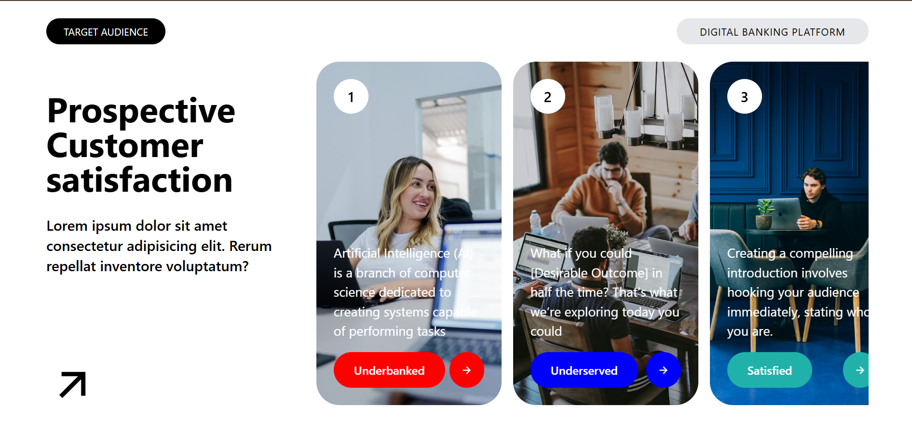

# Day-06
Today i have made a ui-card interface using props in react and tailwindCSS and i see that how classes of tailwin works and also pass data from parents to child and from child to sub-child using props 

---

# Screenshot of my ui-project
this is a screenshot of project using props

