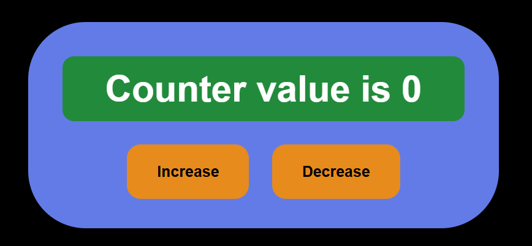

## Day-08

Today I have learnt that how we use Hooks in react and specially use of useState hook i see how we change the values of object or arrays make a small counter app using useState hook and also study batch update concept

---
This is screenshot of Counter project

