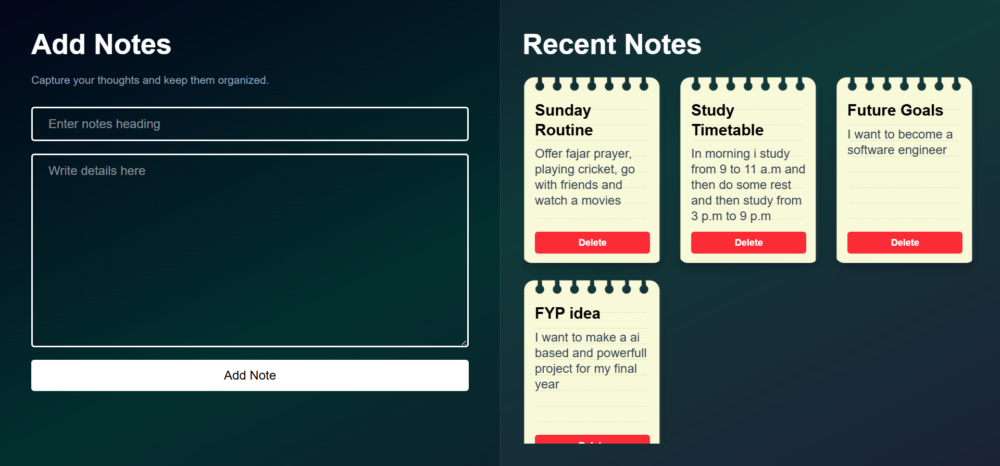

## Day-10

Today I make a project using react useState hook and see how data passes and how we work with real world projects I understand many new concepts in this project

---

Thi is the screen-shot of my latest notes project

---