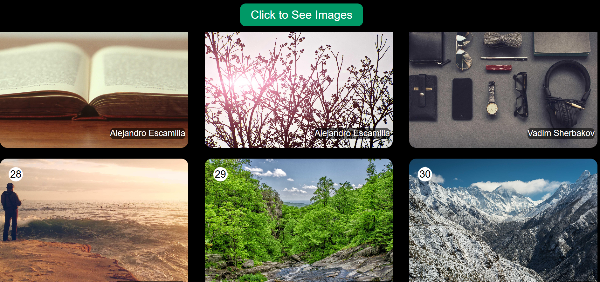

## Day-11

Today I have learnt about local storage and session storage and see how we store data in our borwser 
And I also learnt about Api calling how we use api and fetch data and use in our project but I also use an api of image to show image on my web page 

---

This is how my webpage looks after fetch data from Image Api

---