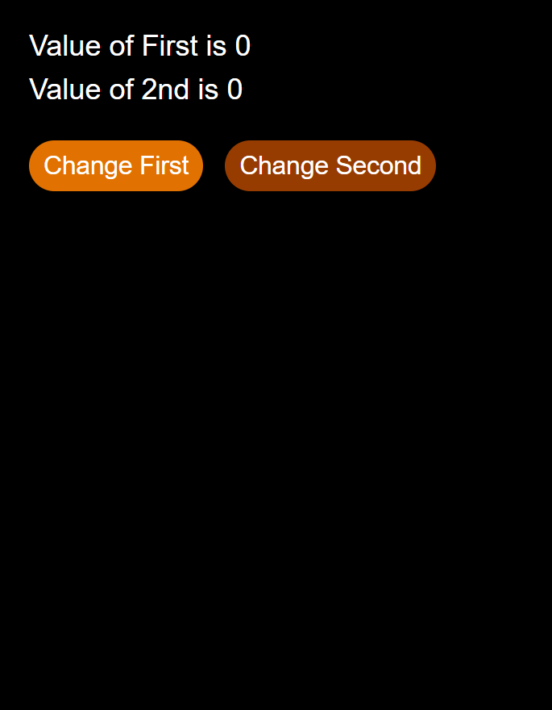

# Day-12: useEffect Hook

Today I learned about the `useEffect` Hook in React, how it works, and how to use the Dependency Array.

### What I Learned
- How to create and use `useEffect`.
- Why `useEffect` is used.
- Role of the Dependency Array.
- How effects run when state values change.
- Using `useState` and `useEffect` together.

### Practice
Created a simple Counter App with two values and two buttons. One button increases the first value and the other decreases the second value. Used `useEffect` to practice running functions when state changes.

