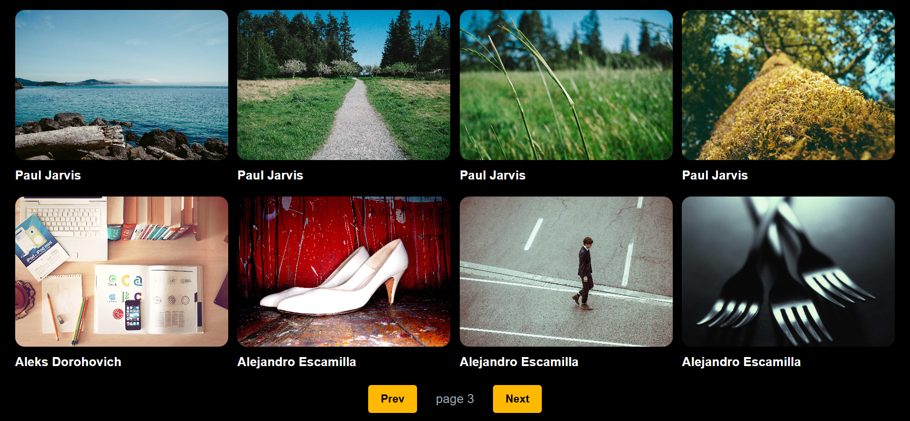

## 🖼️ Day-13: Image Gallery Project

A simple **Image Gallery** built with React JS using an API to fetch and display images dynamically.

## 📌 About

In this project, I created an image gallery that displays **8 images per page**. Users can navigate between pages using **Previous** and **Next** buttons, and new images are automatically fetched from the API when the page changes.

## 📸 Project Screenshot

## 🚀 Features

* Fetch images from an API
* Display 8 images per page
* Previous and Next page navigation
* Automatic data fetching when the page changes
* Dynamic image and author display
* Responsive layout using TailwindCSS

## 🧠 Concepts Practiced

* `useState` Hook
* `useEffect` Hook
* API Calling with Axios
* Async/Await
* Conditional Rendering
* Array `map()` method
* Props
* Pagination
* TailwindCSS

## 🛠️ Technologies Used

* React JS
* TailwindCSS
* Axios
* JavaScript
* Picsum Photos API

## 🎯 Learning Outcome

This project helped me get more practical experience with **React Hooks, API integration, pagination, state management, and automatic data fetching using `useEffect`**.

---