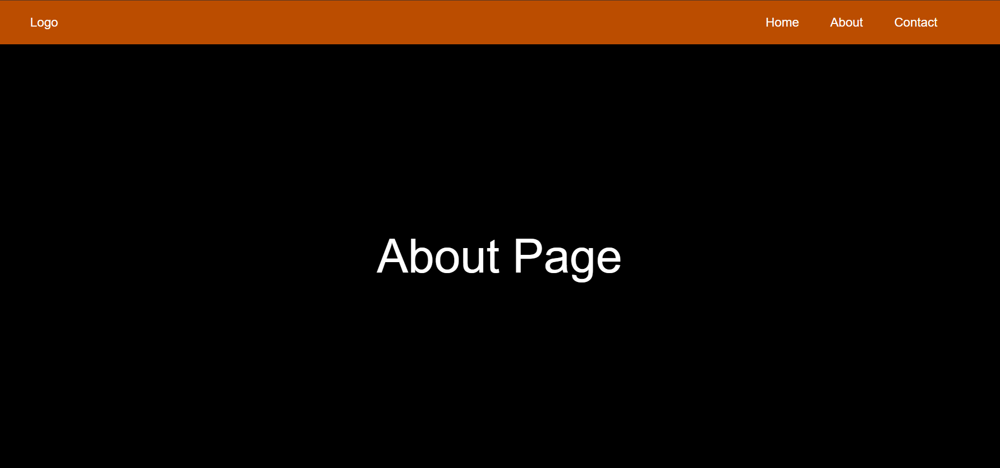

# Day-14: React Router Basics

Today I learned the basics of **React Router** and how routing works in React applications.

## 📚 What I Learned

- How to use **BrowserRouter**
- How to create **Routes and Route**
- How to navigate between different pages
- How to use **Link** for navigation
- Basic understanding of client-side routing

## 🛠️ Practice

Created a simple NavBar with Three different pages and implemented navigation between them using **React Router**.

