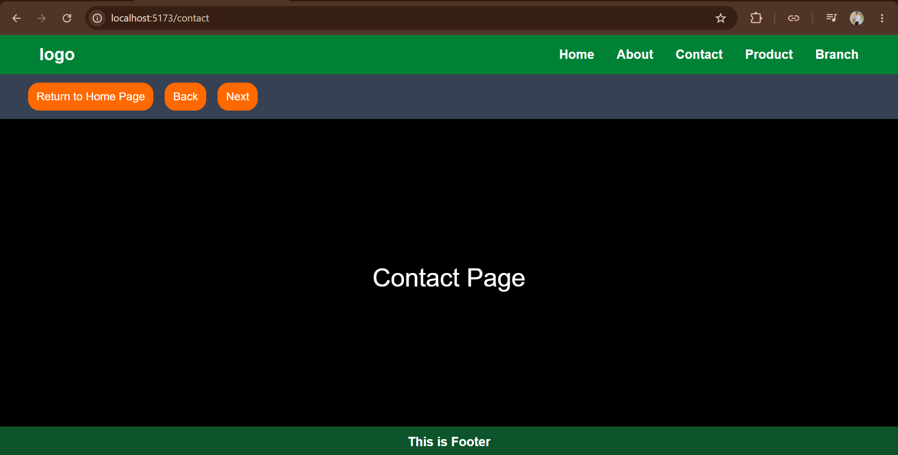

# 🚀 Day-15: Advance React Routing Concepts

Today I learned and practiced the basic concepts of **React Routing** using React Router.

## 📌 Topics Covered

### 1. Basic Routing
Learned how to create different routes and display different components based on the URL.

### 2. Nested Routing
Learned how to create child routes inside a parent route and use `<Outlet />` to display nested components.

### 3. Dynamic Routing
Learned how to create dynamic routes using parameters such as `:id` and access them using `useParams()`.

### 4. 404 / Not Found Page
Learned how to handle incorrect or unknown URLs by creating a **404 Not Found** page using a wildcard route.

### 5. useNavigate
Learned how to navigate between routes programmatically using the `useNavigate()` hook.

## 🧠 Concepts Practiced

- `BrowserRouter`
- `Routes`
- `Route`
- `Link`
- `Outlet`
- `useParams()`
- `useNavigate()`
- Dynamic Routes
- Nested Routes
- 404 Not Found Route

## 🛠️ Technologies Used

- React JS
- React Router DOM
- JavaScript
- Tailwind CSS

## 📸 Project Screenshot

## 🎯 Learning Outcome

Today's practice helped me understand how routing works in React and how to navigate between different pages, create nested and dynamic routes, handle invalid URLs, and navigate programmatically using React Router.

---

⭐ **Day-15 completed — continuing my React JS learning journey!**