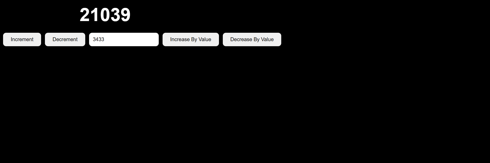

# Day-17 – Redux Toolkit Basics

Today I learned the basics of **Redux Toolkit** and understood how state management works in Redux.

## 📚 What I Learned

- What Redux Toolkit is and why it is used
- How to create a Redux Store
- How to create a Slice
- How to define the initial state
- How to create Reducers
- How Actions are created and dispatched
- How to use `useDispatch()`
- How to use `useSelector()`
- How Redux updates the state and reflects changes in the UI

## 🧮 Mini Project – Redux Counter

I created a simple counter application using Redux Toolkit.

### Features

- Increment the counter value
- Decrement the counter value
- Enter a custom number in an input field
- Increase the counter by the entered number
- Decrease the counter by the entered number

## 🛠️ Technologies Used

- React JS
- Redux Toolkit
- React Redux
- JavaScript
- Tailwind CSS

## 🎯 Learning Outcome

This project helped me understand the basic flow of Redux Toolkit:

**UI → Action → Dispatch → Reducer → Store → Updated UI**

It also gave me practical experience with `createSlice()`, `useDispatch()`, and `useSelector()`.

---

## 📸 Screenshot

