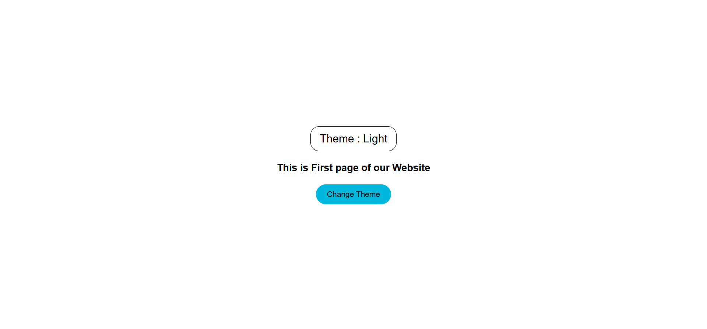

# Day-18: Redux Toolkit Theme Switcher

Today I practiced **Redux Toolkit** by building a basic Theme Switcher in React.

## 🚀 What I Learned

- How to create a Redux store using `configureStore`
- How to create a slice using `createSlice`
- How to define `initialState`
- How reducers update the Redux state
- How actions work in Redux Toolkit
- How to use `useDispatch()` to dispatch an action
- How to use `useSelector()` to get data from the Redux store
- How to change the UI based on Redux state
- How to build a Light/Dark theme switcher

## 🛠️ Technologies Used

- React JS
- Redux Toolkit
- React Redux
- Tailwind CSS
- Vite

## 🎨 Project Features

- Displays the current theme
- Changes between Light and Dark themes
- Uses Redux Toolkit for theme state management
- UI updates automatically when the Redux state changes
- Simple and responsive interface

## 🔄 Redux Flow

```text
Button Click
     ↓
dispatch(ChangeTheme())
     ↓
Action
     ↓
Reducer
     ↓
Redux Store State Updates
     ↓
useSelector()
     ↓
UI Updates
```

## 📸 Screenshot



## 📂 Project

This project is part of my React Learning Journey where I am learning React and related technologies through daily practice.